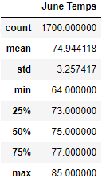
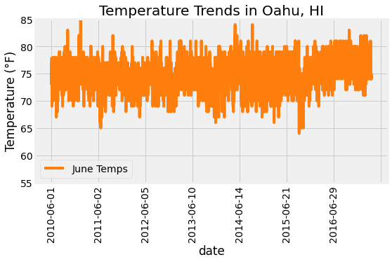
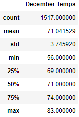
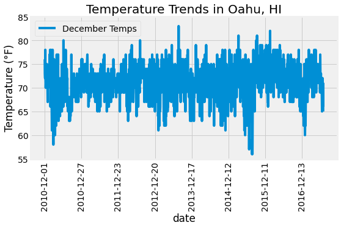
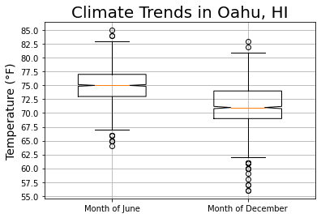
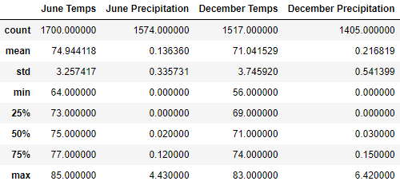

# surfs up
This project focused on the application of Python database toolkits, such as SQLAlchemy and Flask, and how we leveraged their useful functions for performing data analytics and visualization as part of the Extract, Transform, and Load (ETL) process.

## Table of Contents
- [Overview of Project](#overview-of-project)
  - [Resources](#resources)
  - [Challenge Overview](#challenge-overview)
  - [GitHub Repo Branches](#github-repo-branches)
- [Data Engineering and Analysis Results](#data-engineering-and-analysis-results)
  - [Deliverable 1](#deliverable-1)
  - [Deliverable 2](#deliverable-2)
  - [Deliverable 3](#deliverable-3)
- [Summary](#summary)
- [References](#references)

## Overview of Project
This project, including Module 9 assignment, focused on honing our knowledge and skills of data modeling, engineering, and analysis through some rigorous exercises for understanding the concepts of Extract, Transform, and Load ([ETL](https://www.ibm.com/cloud/learn/etl#toc-etl-vs-elt-goFgkQcP)) process, including effective prototyping of data transformation, efficient iterative process, engineering, and analysis of relational databases. We leveraged some useful Python libraries and many of its integrated useful modules, functions, and data structures when accomplishing the Extract and Transform phases of the ETL process more efficiently. We then applied some Structured Query Language (SQL)-like query techniques by using a Python SQL toolkit/Object Relational Mapper for analyzing and manipulating year-round climate databases, and studying the weather trends from the databases, which would be used by our decision-makers before opening the surf shop.

### Resources
- Input file: hawaii.sqlite
- Source code: SurfsUp_Challenge.ipynb, climate_analysis.ipynb, app.py
- Image file: png files
- Software: [SQL Alchemy](https://www.sqlalchemy.org/), [Flask](https://flask.palletsprojects.com/en/2.2.x/), [conda](https://github.com/conda/conda/releases), [Python 3.9](https://docs.python.org/release/3.9.12/), or their newer releases.

### Challenge Overview
Our goal is to further understand the ETL concepts relevant to relational databases through the use of systematic steps and effective tools that we commonly use when prototyping, modeling, engineering, and exploring databases, which could be applied for uncovering various climate data as well as temperature trends for the months of June and December in Oahu, Hawaii. Our analysis results were required to determine if the surf and ice cream shop business was sustainable year-round. Outline of our deliverables and a written report for presenting our results and analysis summary:

- ☑️ Deliverable 1: Determine the Summary Statistics for June
- ☑️ Deliverable 2: Determine the Summary Statistics for December
- ☑️ Deliverable 3: A written report for the statistical analysis (this ["README.md"](./README.md)).

### GitHub Repo Branches
All deliverables in Module 9 challenge are committed in this GitHub repo as outlined below.  

main branch  
|&rarr; [./README.md](./README.md)  
|&rarr; [./hawaii.sqlite](./hawaii.sqlite)  
|&rarr; [./SurfsUp_Challenge.ipynb](./SurfsUp_Challenge.ipynb)  
|&rarr; [./climate_analysis.ipynb](./climate_analysis.ipynb)  
|&rarr; [./app.py](./app.py)  
|&rarr; ./Data/  
  &emsp; |&rarr; [./Data/climate_jun_summary_stats.png](./Data/climate_jun_summary_stats.png)  
  &emsp; |&rarr; [./Data/climate_dec_summary_stats.png](./Data/climate_dec_summary_stats.png)  
  &emsp; |&rarr; [./Data/climate_jun_temp.png](./Data/climate_jun_temp.png)  
  &emsp; |&rarr; [./Data/climate_dec_temp.png](./Data/climate_dec_temp.png)  
  &emsp; |&rarr; [./Data/climate_summary_stats.png](./Data/climate_summary_stats.png)  
  &emsp; |&rarr; [./Data/climate_trends_boxplot.png](./Data/climate_trends_boxplot.png)  

## Data Engineering and Analysis Results
By using several Pandas libraries/modules, including Pandas, SQLAlchemy, Matplotlib, and Flask, to extract and transform the year-round climate databases, we were able to explore the weather trends and deliver the required data. We also created Matplotlib plots to enable better visualization of the analysis results that should let us conduct the due diligence and draw more accurate conclusions.

### Deliverable 1
The corresponding Jupyter Notebook source codes can be referred in [SurfsUp_Challenge.ipynb](./SurfsUp_Challenge.ipynb) and [climate_analysis.ipynb](./climate_analysis.ipynb). I skipped *Step 2* in the challenge notebook, which was a redundant step to convert to a list, because SQLAlchemy `session.query().all()` returns a list of tuples that can be readily converted to a DataFrame. This statement is also true for compiling December temperatures (*Step 7* in [Deliverable 2](#deliverable-2)), which I double checked by using `type(session.query().all())`.

```
# 1. Write a query that filters the Measurement table to retrieve the temperatures for the month of June.
results = session.query(Measurement.date, Measurement.tobs).filter(extract('month', Measurement.date) == 6).all()
# 3. Create a DataFrame from the list of temperatures for the month of June. 
jun_df = pd.DataFrame(results, columns=['date', 'June Temps'])
# 4. Calculate and print out the summary statistics for the June temperature DataFrame.
jun_df.describe()
```

**Table 1** showed the summary statistics of temperature trends in Oahu, HI for the month of June. The graphs in Fig. 1 provided further visualization of temperature trends for the corresponding month across several years.

**Table 1. Summary statistics of June temperature trends in Oahu, HI**\


\
**Fig. 1 Temperature trends in Oahu, HI for the month of June**

### Deliverable 2
Code used for [Deliverable 1](#deliverable-1) can be reused for accomplishing [Deliverable 2](#deliverable-2) with just a few minor revisions. **Table 2** showed the summary statistics of temperature trends in Oahu, HI for the month of December. The graphs in Fig. 2 provided further visualization of temperature trends for the corresponding month across several years.

**Table 2. Summary statistics of December temperature trends in Oahu, HI**\


\
**Fig. 2 Temperature trends in Oahu, HI for the month of December**

### Deliverable 3
To further explore insightful data analytics and visualizations, I wrote some extra codes that might be unique as below. Fig. 3 outlined the summary statistics in visual boxplot formats, which hopefully helped to perform the due diligence better. **Table 3** provided the concise comparison of the overall climate trends in Oahu, HI between June and December.

```
# Create a box-and-whisker plot for June vs December temps
dfs = [jun_df['June Temps'], dec_df['December Temps']]
labels = ['Month of June', 'Month of December']
fig, ax = plt.subplots()
ax.boxplot(dfs, labels=labels, notch=True, widths=0.5)
# Add the title, y-axis label and grid.
ax.set_title('Climate Trends in Oahu, HI', fontsize=20)
ax.set_ylabel('Temperature (\N{DEGREE SIGN}F)', fontsize=14)
ax.set_yticks(np.arange(55, 86, step=2.5))
ax.grid()
# Save the figure.
plt.savefig('./Data/climate_trends_boxplot.png', bbox_inches='tight', facecolor='w')
# Show Figure
plt.show()
```

```
# Added: Write a query that filters the Measurement table to retrieve both tobs and prcp for the month of June. 
results = session.query(Measurement.date, Measurement.tobs, Measurement.prcp).\
filter(extract('month', Measurement.date) == 6).all()
jun_df = pd.DataFrame(results, columns=['date', 'June Temps', 'June Precipitation'])
# Added: Write a query that filters the Measurement table to retrieve both tobs and prcp for the month of December. 
results = session.query(Measurement.date, Measurement.tobs, Measurement.prcp).\
filter(extract('month', Measurement.date) == 12).all()
dec_df = pd.DataFrame(results, columns=['date', 'December Temps', 'December Precipitation'])
# Merge summary statistics of June and December
pd.merge(jun_df.describe(), dec_df.describe(), left_index=True, right_index=True)
```

\
**Fig. 3 Temperature boxplots for the month of December**

**Table 3. Summary statistics of climate trends in Oahu, HI**\


As for the visualization by using Flask, I added a `session.commit()` after executing a `session.query()` in each app route. This allowed me to end the session transaction while keeping the connection open, which was important for preventing refreshing or reloading errors. The code snippet for the temp (*tobs*) route is outlined below and the complete code can be referred in [app.py](./app.py).

```
# define the temp route
@app.route('/api/v1.0/tobs')
def temp_monthly():
  prev_year = dt.date(2017, 8, 23) - dt.timedelta(days=365)
  results = session.query(Measurement.tobs).filter(and_(Measurement.station == 'USC00519281', Measurement.date >= prev_year)).all()
  session.commit()
  temps = list(np.ravel(results))
  return jsonify(temps=temps)
```

## Summary
All deliverables have been completed and summarized according to Module 9 assignment requirements, including some extra analyses and queries as we have discussed in [Deliverable 3](#deliverable-3) for uncovering trends that helped us assess the due diligence processes more accurately. Finally, we are happy to provide the executive summary of our analysis results.

- Overall June temperature was hotter by about **3.9 &deg;F** on average (**Table 3** and Fig. 3). We expected that hotter temperature in June could boost the surfboard and ice cream sales.
	- Minimum temperature was trending at **64 &deg;F** in June versus **56 &deg;F** in December.
	- Maximum temperature was trending at **85 &deg;F** in June versus **83 &deg;F** in December.
- Based on our additional analysis of precipitation data (**Table 3**), June was much drier than December. Again, we expected that drier months, like June, could boost the surfboard and ice cream sales.
	- Average precipitation was trending at **0.136 in/h** for June versus **0.217 in/h** for December.
	- Maximum precipitation was trending at **4.430 in/h** for June versus **6.420 in/h** for December, which suggested the month of December was extremely wet or had a lot of rainfalls. My further research confirmed that our analysis results matched well with the data published by [Go Visit Hawaii](https://www.govisithawaii.com/2014/09/30/hawaii-rainfall-chart-by-month-and-island/#:~:text=%E2%80%93%20Overall%20June%20is%20the%20driest,February%20to%20March%20was%20surprising.).
- December climate around Oahu, HI could fluctuate more significantly compared to that of June, which could create unpredictable situation for surf and ice cream business in December (Fig. 3).

## References
[Pandas User Guide](https://pandas.pydata.org/pandas-docs/stable/user_guide/index.html#user-guide)\
[json - JSON encoder and decoder](https://docs.python.org/3/library/json.html)\
[How to change Order of Columns in Pandas DataFrame?](https://pythonexamples.org/how-to-change-order-of-columns-in-pandas-dataframe/#:~:text=Change%20Order%20of%20DataFrame%20Columns%20in%20Pandas&text=You%20can%20change%20the%20order,rearranged%20column%20list%20as%20argument.&text=The%20reindex()%20function%20returns,the%20given%20order%20of%20columns.)\
[Python - datetime date objects](https://docs.python.org/3.9/library/datetime.html#datetime.date)\
[SQL Alchemy](https://www.sqlalchemy.org/)\
[Option to disable autobegin?](https://github.com/sqlalchemy/sqlalchemy/discussions/6921)\
[Using OR in SQLAlchemy](https://stackoverflow.com/questions/7942547/using-or-in-sqlalchemy)\
[Flask](https://flask.palletsprojects.com/en/2.2.x/)\
[Matplotlib - Plot types](https://matplotlib.org/stable/plot_types/index.html)
